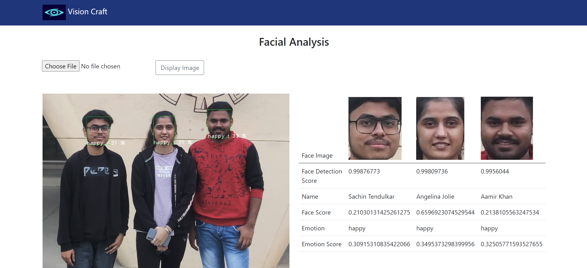

# VisionCraft: Computer Vision & Emotion Recognition

Welcome to VisionCraft, a comprehensive project blending Computer Vision and Machine Learning. This Django-based web app excels in precise face and emotion recognition.


## Key Features

- **Machine Learning Integration:** Leverage powerful ML models for accurate face and emotion recognition.
- **Django Framework:** MVT architecture ensures a robust and scalable web application.

## Getting Started

1. Clone the repository.
    ```bash
    git clone https://github.com/your-username/visioncraft.git
    ```

2. Install dependencies using `requirements.txt`.
    ```bash
    pip install -r requirements.txt
    ```

3. Run the Django app locally.
    ```bash
    python manage.py runserver
    ```

4. Explore the web app at [http://localhost:8000](http://localhost:8000).

## Screenshots

### Home Page


## Contributors

- Nishu Malik - Project Lead & Developer
- Ayush Goyal - Machine Learning Engineer
- Shakeeb Parwez - Database Administrator & Backend Developer

Feel free to contribute and enhance VisionCraft! 

---

*VisionCraft is a semester project created by a team of three passionate individuals in the field of image processing and machine learning.*
